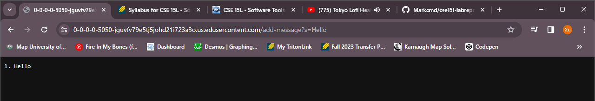
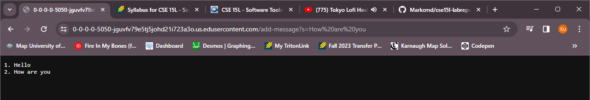
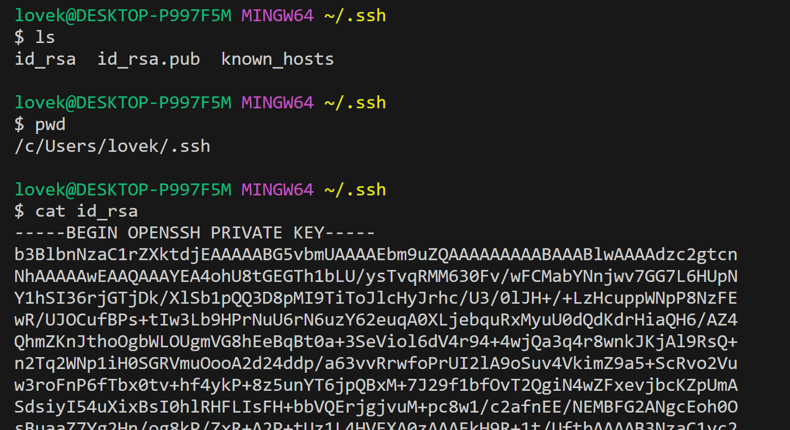
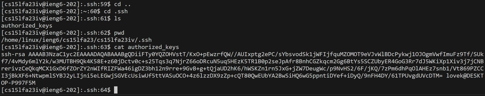
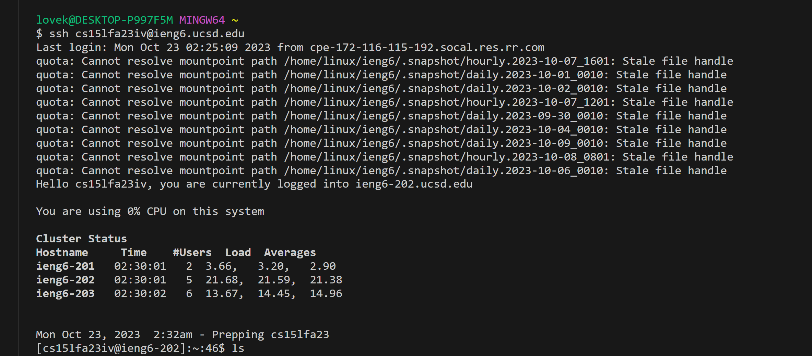

# CSE15L
## Lab 2

### Part 1
Code for my file "StringServer.java"
```
import java.io.IOException;
import java.net.URI;

class Handler implements URLHandler {
  // A String that will be manipulated by various requests.
  String str = "";
  // A number that count number of requests.
  int num = 0;

  public String handleRequest(URI url) {
    if (url.getPath().equals("/")) {
      return str;
    }else{
      if (url.getPath().contains("/add-message")) {
        String[] parameters = url.getQuery().split("=");
        if(parameters[0].equals("s")){
          num +=1;
          str = str + String.valueOf(num)+ ". " + parameters[1].replace('+', ' ')+ "\n" ;
          return str;
        }
      } 
      return "404 Not Found!";
    }
  }
}

class StringServer {
    public static void main(String[] args) throws IOException {
        if(args.length == 0){
          System.out.println("Missing port number! Try any number between 1024 to 49151");
          return;
        }

    int port = Integer.parseInt(args[0]);
    
    Server.start(port, new Handler());  
    }
}
```
Screenshots:


+ Which methods in your code are called?
  + Server.start ()
  + main () 
  + handleRequest ()
  + 
+ What are the relevant arguments to those methods, and the values of any relevant fields of the class?
  + Server.start()

    The relevant arguments are "port" and "new Handler".

    "port" is a int value, which contains the prot number passed from args[0].

    "new Handler" is an object of the class Handler.
  + main()

    The relevant arguments are args, which is a string array.

  + handleRequest()

    The relevant argumetns are rul, an URI object contain command of URL.

+ How do the values of any relevant fields of the class change from this specific request? If no values got changed, explain why.

  In class handler fields, there are two values "str" and "num", which is "String" and "int" values

  num is starting from 0, and it increments 1 through each request. In this way, num counts the number of requests.

  str is starting from empty string. And in every request there are a string that converted from new num values, a ". " string, a new massage from url and a "\n" will add to the str. "\n" split every request into new lines.


### Part 2
Using the command line, show with ls and take screenshots of:
+ The path to the private key for your SSH key for logging into ieng6 (on your computer or on the home directory of the lab computer)

+ The path to the public key for your SSH key for logging into ieng6 (within your account on ieng6)

+ A terminal interaction where you log into ieng6 with your course-specific account without being asked for a password.


### Part 3
I learned:
+ how to connect to the computer in the cse basement, through my computer termial with command ssh <my_user_name>
+ how to make a server through termial by compiling and executing my Server.java and Program.java file that I saved in my git hub repository.
+ getting familier with some terminal command.
+ What is directory and path and how it works.
+ How web Search Enging basiclly works
+ URLs not allowed spaces, spaces will chagend to +. (So I used .replace('+', ' ') function to correct it.)
+ How to use scp command connect my computer and the computer inthe cse basement, in order to avoid repeatedly enter the password when login to my account.


